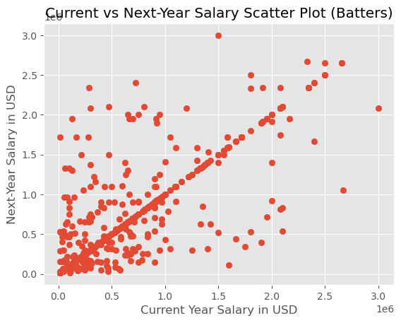
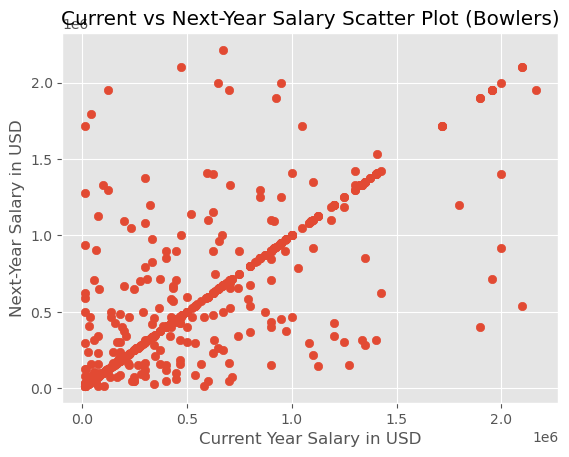
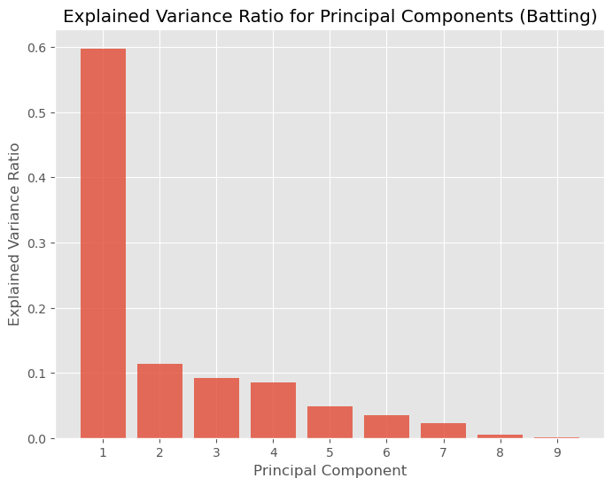
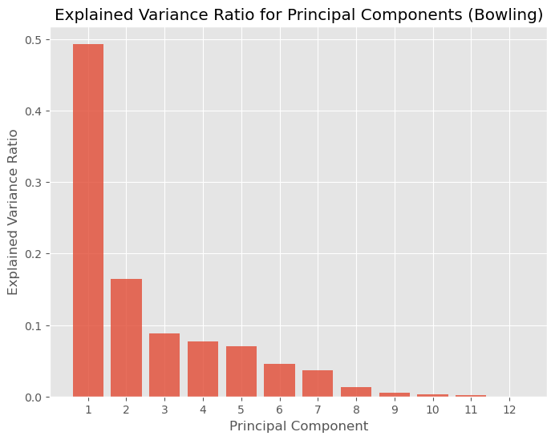
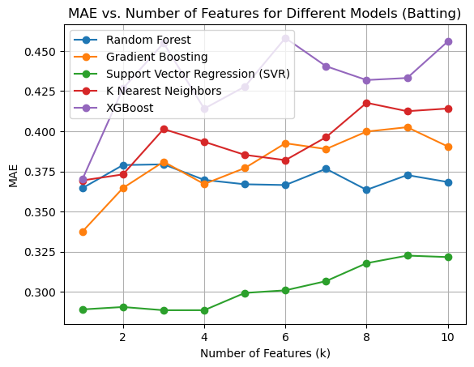
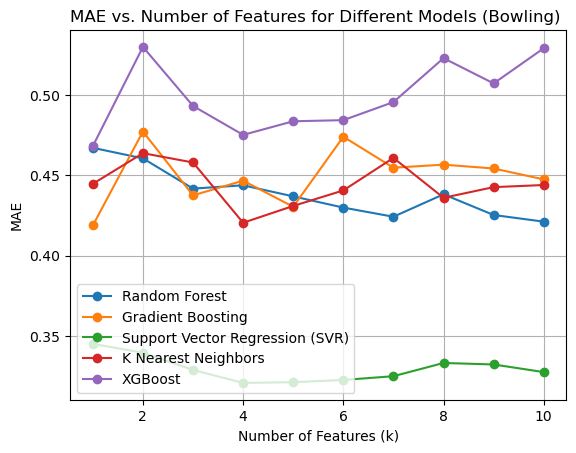

# **Project Report: Predictive Modeling of IPL Player Salary**

# **Problem Statement**
The Indian Premier League (IPL) has become a global cricket phenomenon since its inception in 2008, driving growth in player salaries. This project will develop a Machine Learning model to predict the player salary based on statistical aggregate features. In doing so, I will develop a framework for the IPL franchises to make more informed decisions during player auctions on the expected salary of the players.

# **Approach**
The data for this project was sourced from two distinct repositories. Firstly, ball-by-ball match data spanning the years 2008 to 2021 was acquired from the dataset hosted on Kaggle (https://www.kaggle.com/datasets/vora1011/ipl-2008-to-2021-all-match-dataset). Secondly, salary information of players was extracted from the online resource available at http://www.cricmetric.com/ipl/salary/. 

## **1. Data Wrangling and Feature Engineering**
[Data Wrangling Notebook](./1-DataWrangling.ipynb)

[Player Country and Role Scraping](./WikiScrape.ipynb)

During the data wrangling and feature engineering phase, the match data was integrated and filtered, consolidating it with relevant attributes such as player salaries and roles. The ball-by-ball data was used to calculate batting and bowling statistics for players across multiple seasons.
For batters, the following features were engineered:
1. **balls_faced**: Total number of balls faced by the batter.
2. **total_runs**: Cumulative runs scored by the batter.
3. **batting_avg**: Batting average calculated as the ratio of total runs to the number of wicket deliveries faced.
4. **strike_rate**: Strike rate calculated as the percentage of runs scored per ball faced.
5. **50s**: Number of half-centuries (scores between 50 and 99) achieved by the batter.
6. **100s**: Number of centuries (scores of 100 or more) achieved by the batter.
7. **4s**: Total number of boundaries (4 runs) hit by the batter.
8. **6s**: Total number of sixes (6 runs) hit by the batter.

For bowlers, the following features were engineered:
1. **balls_bowled**: Total number of balls bowled by the player.
2. **total_runs**: Cumulative runs conceded by the bowler.
3. **total_wickets**: Total number of wickets taken by the bowler.
4. **bowling_avg**: Bowling average calculated as the ratio of total runs conceded to the total wickets taken.
5. **economy**: Bowling economy rate calculated as runs conceded per over bowled.
6. **strike_rate**: Bowling strike rate calculated as the ratio of balls bowled to wickets taken.
7. **3whs**: Number of matches where the bowler took between 3 and 4 wickets.
8. **5whs**: Number of matches where the bowler took 5 or more wickets.
9. **dots**: Total number of dot deliveries (no runs scored) bowled by the player.
10. **4s**: Total number of boundaries (4 runs) conceded by the bowler.
11. **6s**: Total number of sixes (6 runs) conceded by the bowler.

## **2. EDA**
[Exploratory Data Analysis notebook](./2-ExploratoryDataAnalysis.ipynb)

The target variable for the analysis was the next-year salary for each player. The initial hypothesis was that the biggest determining factor of a player's next-year salary was the player's current salary. The following graphs corroborated that hypothesis:

  
  

Furthermore, after principal component analysis, it was determined that the problem of predicting player salary is almost one-dimensional. If required, we could expand our analysis to 4 dimensions for batting or bowling. Similar arguments could be made for including more features, but ultimately, that would be decided during the evaluation of model performance.

  
  

## **3. Model Selection**
[Model Selection Notebook](./3-PreprocessingTrainingDevelopment.ipynb)

The metric chosen to evaluate the various regression models was Mean Absolute Error (MAE). This is due to several reasons:
* The absolute difference between the predicted and actual salary has a real-world interpretation. MAE directly measures the average salary prediction error, which aligns with estimating player salaries accurately.
* MAE is less sensitive to outliers compared to other metrics because it treats all errors equally without squaring them. This makes it a good choice since outliers can disproportionately affect the model's performance evaluation.
* MAE is a linear metric, meaning that errors are considered proportionally. 

The following two graphs show the performance of several tested models against number of selected features.

  
  

In both cases, it was determined that the best-performing models were Support Vector Regression with $k=4$ selected features. This suggests that the relationship between the predictor variables (features) and the target variable (next-year salary) is not purely linear. The model's handling of nonlinear relationships imply that the dataset contains different impact from different features. As more data becomes available, it might be useful to limit the number of selected features below 4 in order to balance model performance against computing resources.

The batting SVR model was fine-tuned, and found the following optimal hyperparameters: 'C' (Regularization parameter) set to 10, 'epsilon' (Epsilon parameter for margin of error) set to 0.01, and the 'kernel' chosen as 'linear'. This parameter configuration yielded an R^2 score of 0.691, and an MAE score of 0.252.

The bowling SVR model was fine-tuned, and found the following optimal hyperparameters: 'C' (Regularization parameter) set to 1, 'epsilon' (Epsilon parameter for margin of error) set to 0.01, and the 'kernel' chosen as 'linear'. This parameter configuration yielded an R^2 score of 0.653, and an MAE score of 0.265.

## **4. Predictions and Uses**
[Predictions Notebook](./4-Predictions.ipynb)

The **`predict_salary`** function was developed to leverage the trained SVR models to make predictions of a player's salary based on the aggregate statistics as an input. The input data is should be in the form of the original data with the engineered features (listed above). Due to the nature of the generally-available statistics in cricket, the engineered features are easily accessible for any player in the IPL.

*Possible use cases*:
* Player Valuation and Auction Strategy: By accurately estimating a player's potential next-year salary, franchises can make more informed decisions when bidding for players.
* Talent Scouting and Recruitment: Talent scouts can leverage the insights from this project to identify promising players with the potential for high future salaries.
* Player Performance Analysis and Contract Negotiation: Cricket players and their agents can leverage the model during contract negotiations. By understanding the key performance metrics that contribute to higher salaries, players can focus on improving specific aspects of their game. Agents can use the predictive model to provide evidence-based salary expectations.

# **Further Questions**
* Cross-League Comparison: Extend the analysis to include data from other cricket leagues and international games. 
    * How do player salaries and their determinants vary across different leagues?
    * How does player performance in other leagues or international games affect their IPL salary?
* Player Performance Trajectories: Can the model be extended to predict longer-term career salary trajectories? 
* Mega vs Mini Auctions: As more data becomes available, can the model be refined to make separate predictions for the Mega-auctions (occurring once every four years) and Mini-auctions (occurring every year there is no Mega-auction)?
* Advanced Model Architectures: How do more advanced models (such as deep learning models or ensemble methods) compare to the current SVR-based approach in terms of predictive power?
* Accounting for Player Hype: Can NLP models be applied (such as analyzing ESPNcricinfo article sentiment) to account for player "hype" in predicting player salary?

# **Summary and Conclusions:**
In this project, I aimed to predict Indian Premier League (IPL) player salaries using a Machine Learning approach. Using ball-by-ball match data and player salary information,I engineered the relevant features for both batters and bowlers. This included metrics such as batting and bowling averages, strike rates, centuries, wickets, etc. Exploratory Data Analysis (EDA) revealed a strong correlation between current-year and next-year salaries for players, establishing a foundation for the modeling.

Mean Absolute Error (MAE) was chosen as my evaluation metric. Support Vector Regression (SVR) with a linear kernel and a limited set of features provided the best performance. Fine-tuning of hyperparameters led to optimized models for both batting and bowling, with R^2 scores of 0.691 and 0.653, respectively, along with MAE scores of 0.252 and 0.265. Finally, I developed a predictive function using the trained SVR models to estimate player salaries based on their aggregated statistics.

As data from the IPL continues to be generated, models like this will only improve in their predictive power, and allow us to explore more avenues to fine-tune our models.
